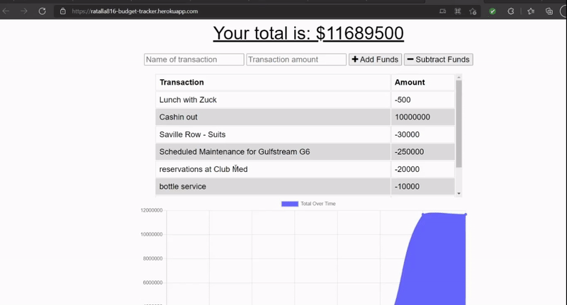

# Budget Tracker

  
    
  
   
  
   
  
   
  
   
  
  
  ## Description
  
   AS AN avid traveler
  I WANT to be able to track my withdrawals and deposits with or without a data/internet connection
  SO THAT my account balance is accurate when I am traveling 
  GIVEN a budget tracker without an internet connection
  WHEN the user inputs an expense or deposit
  THEN they will receive a notification that they have added an expense or deposit
  WHEN the user reestablishes an internet connection
  THEN the deposits or expenses added while they were offline are added to their transaction history and their totals are updated
 
  ## Table of Contents
  - [Description](#description)
  - [Documentation](#documentation)
  - [Deployment](#deployment)
  - [Screenshot](#screenshot)
  - [Features](#features)
  - [Acknowledgements](#acknowledgements)
  - [License](#license)
  - [Testing](#testing)
  - [Contact](#contact)

  ## Documentation
  * MongoDB Atlas <https://docs.atlas.mongodb.com/getting-started/>
  * Lite Server <https://www.npmjs.com/package/lite-server>
  * Express <https://www.npmjs.com/package/express/v/4.17.1>
  * Mongoose <https://www.npmjs.com/package/mongoose/v/5.5.15>
  * Morgan <https://www.npmjs.com/package/morgan>
  * Heroku <https://devcenter.heroku.com/>
 
  ## Deployment
  This app is deployed using Heroku <https://ratalla816-budget-tracker.herokuapp.com/>

  ## Screenshot
  

  ## Features
  * service worker
  * manifest.json
  * IndexedDB for offline persistence 
    
  # Acknowledgements
  Rob Atalla
    
  ## License
  
   
  Permission to use this application is granted under the MIT license. <https://opensource.org/licenses/MIT>

  ## Testing
  Not available

  ## Contact:
  Holler at me! <a href="mailto:rob.atalla@robatalla816.com">rob.atalla@robatalla816.com</a>